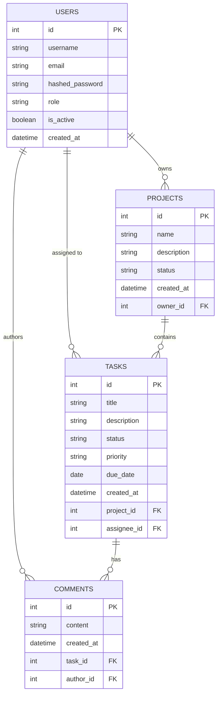

# Database Schema (ER Diagram)

The application uses an SQLite relational database (can be swapped for PostgreSQL/MySQL) with the following schema:

```mermaid
erDiagram
    USERS ||--o{ PROJECTS : "owns"
    USERS ||--o{ TASKS : "assigned to"
    USERS ||--o{ COMMENTS : "authors"
    
    PROJECTS ||--o{ TASKS : "contains"
    TASKS ||--o{ COMMENTS : "has"

    USERS {
        int id PK
        string username
        string email
        string hashed_password
        string role
        boolean is_active
        datetime created_at
    }

    PROJECTS {
        int id PK
        string name
        string description
        string status
        datetime created_at
        int owner_id FK
    }

    TASKS {
        int id PK
        string title
        string description
        string status
        string priority
        date due_date
        datetime created_at
        int project_id FK
        int assignee_id FK
    }

    COMMENTS {
        int id PK
        string content
        datetime created_at
        int task_id FK
        int author_id FK
    }
```
